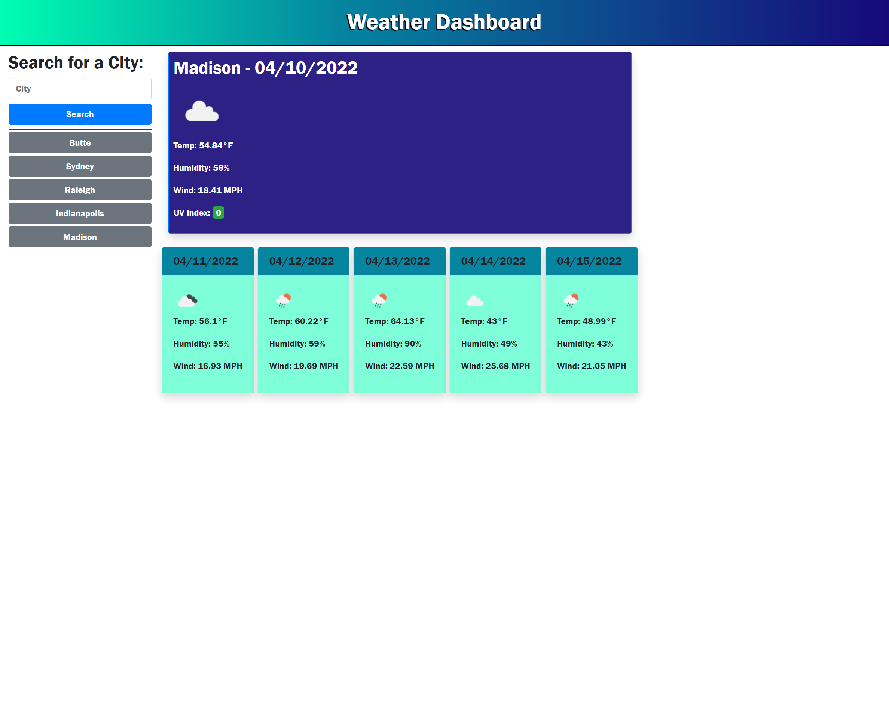

# weather-dashboard

## Description
Check out the current weather conditions and the forecast for the next 5 days with this handy weather app! An icon will show the general weather conditions for each date along with the temperature, humidity, and wind speed. For the current date, the UV index is also displayed with a colored background indicating the severity of that day's UV index. 
For convenience, searched cities may be quickly selected again from a list of buttons to the side of the forecast display.

## Screenshot of Webpage

## Deployed Webpage
https://michaelsamm.github.io/weather-dashboard/